# DIAGRAMS FOR ADAPTIVE BACKGROUND SCANNING ARTICLE

## 1. ALGORITHM ARCHITECTURE DIAGRAM

```mermaid
graph TD
    A[User Input] --> B[Scan Mode Selection]
    B --> C{Mode Type}
    C -->|Realtime| D[5 min interval<br/>10m threshold]
    C -->|Balanced| E[15 min interval<br/>25m threshold]
    C -->|Powersave| F[30 min interval<br/>50m threshold]
    
    D --> G[Dynamic Threshold Calculation]
    E --> G
    F --> G
    
    G --> H[Battery Level Check]
    H --> I[Adaptive Threshold Adjustment]
    I --> J[Movement Detection]
    J --> K{Distance ≥ Threshold?}
    K -->|Yes| L[Perform Scan]
    K -->|No| M[Skip Scan]
    
    L --> N[Update Position History]
    M --> N
    N --> O[Adaptive Learning]
    O --> P[Performance Monitoring]
    
    style A fill:#e1f5fe
    style L fill:#c8e6c9
    style M fill:#ffcdd2
    style G fill:#fff3e0
```



## 2. PERFORMANCE COMPARISON CHART


## 3. ADAPTIVE THRESHOLD CALCULATION FLOW

```mermaid
flowchart TD
    A[Current Battery Level] --> B{Battery Level Check}
    B -->|100%| C[battery_factor = 1.0]
    B -->|75%| D[battery_factor = 1.125]
    B -->|50%| E[battery_factor = 1.25]
    B -->|25%| F[battery_factor = 1.375]
    B -->|10%| G[battery_factor = 1.45]
    
    H[Selected Mode] --> I{Mode Type}
    I -->|Realtime| J[base_threshold = 10m<br/>multiplier = 1.0]
    I -->|Balanced| K[base_threshold = 25m<br/>multiplier = 2.5]
    I -->|Powersave| L[base_threshold = 50m<br/>multiplier = 5.0]
    
    C --> M[Calculate Adaptive Threshold]
    D --> M
    E --> M
    F --> M
    G --> M
    
    J --> M
    K --> M
    L --> M
    
    M --> N[adaptive_threshold = base_threshold × multiplier × battery_factor]
    N --> O[Apply Threshold to Movement Detection]
    
    style M fill:#ff9800,color:#fff
    style N fill:#4caf50,color:#fff
```



## 4. EXPERIMENTAL SETUP OVERVIEW


## 5. MATHEMATICAL MODEL VISUALIZATION

```mermaid
graph LR
    subgraph "Input Variables"
        A1[base_threshold = 10m]
        A2[mode_multiplier = {1.0, 2.5, 5.0}]
        A3[battery_level ∈ [0,1]]
    end
    
    subgraph "Calculations"
        B1[battery_factor = 1.0 + 0.5 × (1 - battery_level)]
        B2[threshold = base_threshold × mode_multiplier]
        B3[adaptive_threshold = threshold × battery_factor]
    end
    
    subgraph "Output"
        C1[Final Threshold Value]
        C2[Movement Detection Decision]
    end
    
    A1 --> B2
    A2 --> B2
    A3 --> B1
    
    B1 --> B3
    B2 --> B3
    
    B3 --> C1
    C1 --> C2
    
    style B3 fill:#9c27b0,color:#fff
    style C1 fill:#4caf50,color:#fff
```

## 6. USER EXPERIENCE IMPROVEMENT FLOW


---

## 📝 **CARA MENGGUNAKAN DIAGRAM INI:**

1. **Mermaid Diagrams** - Copy kode dan paste di editor yang support Mermaid (GitHub, GitLab, dll.)
2. **Untuk Artikel** - Bisa dikonversi ke gambar atau digunakan sebagai referensi visual
3. **Untuk Presentasi** - Bisa di-export sebagai gambar atau digunakan langsung

**Apakah Anda ingin saya buat diagram lain atau memodifikasi yang sudah ada?**
